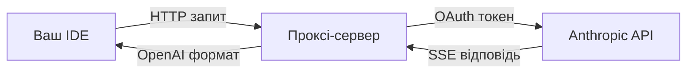

# 🚀 Cursor-Claude Connector

> **Вичавлюйте максимум із вашої підписки Claude**: використовуйте повну потужність Claude у вашому улюбленому IDE (наприклад, Cursor)

> **Середовище виконання**: сервіс переписано на **Go 1.26+**. Оригінальна реалізація на Bun/TypeScript більше не підтримується; Go-версія є повністю сумісною замінною за HTTP API.

---

## 🇺🇦 Про що цей проєкт

`cursor-claude-connector` — це проксі, що дає змогу використовувати вашу підписку **Claude Pro / Max** у будь-якому IDE з підтримкою OpenAI-сумісного API (Cursor, Continue, Codeium тощо). Проксі:

1. Приймає запити від IDE у форматі OpenAI `/v1/chat/completions`.
2. Перетворює їх на формат Anthropic `/v1/messages`.
3. Передає їх до Anthropic, використовуючи **OAuth-токен вашого акаунта Claude**.
4. Перетворює SSE-відповідь Anthropic назад у OpenAI-формат і повертає у IDE.

Жодних додаткових витрат понад вашу звичайну підписку Claude.

### Архітектура



---

## 💡 Навіщо використовувати Claude в IDE

### Переваги Claude

- 🔥 **Повний доступ** до найновіших моделей Claude
- 🚫 **Без обмежень** щодо кількості токенів, які зазвичай є у Claude Max
- 🧠 **Повний контекст** без компресії
- 📁 **Великі файли** та складні проєкти обробляються без проблем

### Переваги IDE

- 💻 **Code-first інтерфейс**, створений для розробки
- 📂 **Управління файлами** — навігація та редагування кількох файлів одночасно
- 🔀 **Контроль версій** — повна інтеграція з Git
- 🧩 **Розширення** — доступ до екосистеми плагінів IDE

### Економія

- 🪙 Уже платите за Claude Max? Використовуйте скрізь
- ♻️ Одна підписка — декілька середовищ
- 💎 Повна цінність вашої підписки Claude

---

## ⚠️ Вимоги Cursor

> **Зверніть увагу**: для використання agent-режиму з власним API-ключем (BYOK — Bring Your Own Key) потрібен план Cursor **від $20/місяць**. Безкоштовний тариф підтримує лише базові автодоповнення.

---

## 🚀 Швидкий старт

### 🐳 Запуск через Docker (рекомендовано)

Збірок контейнера працює на будь-якій платформі — Fly.io, Render, Railway, VPS, або локально:

```bash
docker build -t cursor-claude-connector .
docker run --rm -p 9095:9095 \
  -e UPSTASH_REDIS_REST_URL=... \
  -e UPSTASH_REDIS_REST_TOKEN=... \
  -e API_KEY=... \
  cursor-claude-connector
```

Багатоступеневий `Dockerfile` збирає статичний бінарь на `golang:1.26-alpine` і кладе його в `distroless/static-debian12`. Фінальний образ — маленький, без оболонки.

### 🛠️ Локальна розробка

1. **Клонуйте репозиторій**

   ```bash
   git clone https://github.com/Maol-1997/cursor-claude-connector.git
   cd cursor-claude-connector
   ```

2. **Встановіть Go 1.26+**

   ```bash
   # macOS
   brew install go

   # Linux (Debian/Ubuntu)
   wget https://go.dev/dl/go1.26.4.linux-amd64.tar.gz
   sudo tar -C /usr/local -xzf go1.26.4.linux-amd64.tar.gz
   export PATH=$PATH:/usr/local/go/bin
   ```

3. **Налаштуйте Upstash Redis**

   - Створіть безкоштовну базу Redis у [Upstash Console](https://console.upstash.com/)
   - Скопіюйте `REST URL` та `REST Token`
   - Скопіюйте `env.example` у `.env` і заповніть значення:

   ```bash
   cp env.example .env
   # Відредагуйте .env та впишіть свої дані Upstash
   ```

4. **Запустіть скрипт**

   ```bash
   ./start.sh
   # або еквівалентно:
   make build && ./cursor-claude-connector
   ```

5. **Автентифікуйтесь у Claude**

   - Відкрийте у браузері `http://localhost:9095/`
   - Натисніть **«Connect with Claude»**
   - Пройдіть OAuth-флоу в браузері
   - Вставте отриманий код на сторінку та натисніть **«Submit Code»**

6. **Налаштуйте Cursor**

   - Перейдіть у **Settings → Models**
   - Увімкніть **«Override OpenAI Base URL»**
   - Введіть: `http://localhost:9095/v1`
   - Якщо під час розгортання ви встановили `API_KEY`, додайте його в поле API key у Cursor

---

## 🔑 Змінні середовища

| Змінна | Обов'язкова | Опис |
|--------|-------------|------|
| `UPSTASH_REDIS_REST_URL` | так (для збереження токенів) | REST URL бази Upstash |
| `UPSTASH_REDIS_REST_TOKEN` | так (для збереження токенів) | REST Token бази Upstash |
| `API_KEY` | ні | Додатковий Bearer-токен для захисту проксі |
| `ANTHROPIC_OAUTH_CLIENT_ID` | ні | OAuth client id (за замовчуванням — офіційний Claude CLI) |
| `PORT` | ні | Порт HTTP-сервера (за замовчуванням `9095`) |

---

## 📡 HTTP API

### `GET /`
Віддає вбудований веб-інтерфейс для OAuth-автентифікації (HTML).

### `POST /auth/oauth/start`
Ініціює OAuth-флоу. Повертає URL авторизації та sessionId:

```json
{ "success": true, "authUrl": "https://claude.ai/oauth/authorize?…", "sessionId": "…" }
```

### `POST /auth/oauth/callback`
Приймає код, отриманий від Anthropic, і обмінює його на токени:

```json
{ "code": "code#verifier" }
```

### `GET /auth/status`
Перевіряє, чи є валідний OAuth-токен:

```json
{ "authenticated": true }
```

### `GET /auth/logout`
Видаляє збережені токени.

### `GET /v1/models`
Список доступних моделей Anthropic (проксує `models.dev`).

### `POST /v1/chat/completions` та `POST /v1/messages`
OpenAI-сумісний ендпоінт, що проксує запит до Anthropic. Підтримує обидва формати — OpenAI `chat.completions` і рідний Anthropic `messages`.

---

## 🛡️ Безпека

- Використовує ваш існуючий акаунт Claude (OAuth Bearer-токен)
- Опційний `API_KEY` додає додатковий шар автентифікації
- Код відкритий, ви можете його перевірити

### Поради

- 🔒 **Ніколи не публікуйте** `UPSTASH_REDIS_REST_TOKEN` чи `API_KEY`
- 🌐 **Для публічних URL** обов'язково встановіть `API_KEY`
- 🔄 **Токени автоматично оновлюються** — не потрібно повторно логінитися
- 🚪 **`/auth/logout`** миттєво видаляє токени

---

## 📦 Версії, що використовуються

| Компонент | Версія | Нотатка |
|-----------|--------|---------|
| Go | 1.26+ | мінімально необхідно для бінарного файлу |
| `@anthropic-ai/sdk` (user-agent) | 0.104.2 | поточна стабільна, 2026-06-15 |
| Node.js (user-agent) | 24.x LTS (Jod) | поточна LTS-гілка |
| `anthropic-version` | 2023-06-01 | без змін в офіційному SDK |
| `anthropic-beta` (OAuth) | oauth-2025-04-20 | відповідає `OAUTH_API_BETA_HEADER` у SDK |

Остання синхронізація значень user-agent — **2026-06-17**.

---

## 🧪 Тестування

```bash
make test    # go test ./...
make vet     # go vet ./...
make build   # go build -o cursor-claude-connector ./cmd/cursor-claude-connector
```

Покриття включає:
- `internal/auth` — PKCE, формування URL, обмін коду на токени
- `internal/cursor` — детекція BYOK-сигнатури Cursor
- `internal/proxy` — трансформація OpenAI → Anthropic, `max_tokens` для opus/sonnet
- `internal/streaming` — потоковий конвертер SSE (text, tool-use deltas, scaner)

---

## 📁 Структура проєкту

```
cursor-claude-connector/
├── go.mod
├── go.sum
├── Makefile
├── Dockerfile
├── start.sh
├── env.example
├── README.md / DEPLOYMENT.md
├── cmd/cursor-claude-connector/
│   ├── main.go                 # //go:embed public/, graceful shutdown
│   └── public/index.html       # вбудований фронт
└── internal/
    ├── config/                 # завантажувач .env + process env
    ├── store/                  # Upstash REST клієнт + Credentials
    ├── auth/                   # PKCE, /oauth/authorize, /v1/oauth/token, refresh
    ├── cors/                   # preflight + middleware
    ├── cursor/                 # BYOK probe bypass
    ├── proxy/                  # Anthropic /v1/messages + models.dev + transform
    ├── streaming/              # Anthropic SSE → OpenAI chat.completion.chunk
    └── server/                 # http.ServeMux з pattern-маршрутами
```

---

## 🤝 Внесок

Pull-запити та issues вітаються! Якщо знайшли проблему або маєте ідею — відкривайте issue або PR.

---

## 📄 Ліцензія

MIT — використовуйте цей проєкт як завгодно.

---

> **Зауваження**: цей проєкт не афілійований з Anthropic чи Cursor. Це інструмент спільноти, що покращує досвід розробки.
